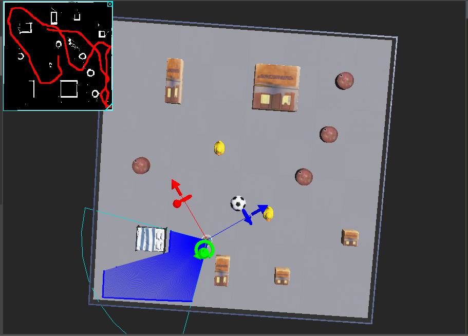
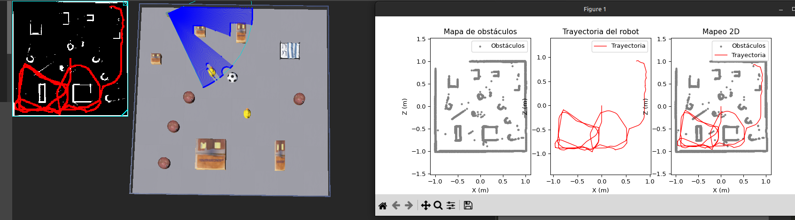

# Autonomous Mapping and Obstacle Detection with LiDAR (Webots + C + Python)

Este proyecto implementa un **sistema de mapeo 2D y navegación autónoma** utilizando un robot con sensor **LiDAR** en el simulador **Webots**.
El robot detecta obstáculos, genera un **mapa de ocupación** en tiempo real y guarda los datos para su análisis con **Python y Matplotlib**.

---

## Descripción General

El objetivo del proyecto es desarrollar un sistema que permita a un robot:

* **Explorar un entorno desconocido.**
* **Detectar obstáculos** con un sensor LiDAR.
* **Construir un mapa de ocupación 2D** (mapeo).
* **Evitar colisiones y navegar de forma autónoma.**
* **Exportar datos** para su análisis externo (trayectoria y obstáculos).

Todo el proceso se desarrolla en **Webots**, con un controlador principal programado en **C** y una herramienta de análisis en **Python**.

---

## Tecnologías y Sensores Utilizados

| Elemento                | Descripción                                                                                       |
| ----------------------- | ------------------------------------------------------------------------------------------------- |
| **Webots**              | Simulador de robótica usado para probar el sistema.                                               |
| **LiDAR**               | Sensor que mide distancias mediante pulsos láser, generando una nube de puntos del entorno.       |
| **GPS**                 | Permite obtener la posición global del robot (X, Z).                                              |
| **IMU (Inertial Unit)** | Mide la orientación (ángulo de yaw) necesaria para posicionar correctamente los puntos del LiDAR. |
| **Display**             | Panel gráfico de Webots donde se dibuja el mapa de ocupación en tiempo real.                      |
| **C (controlador)**     | Implementa el algoritmo de mapeo, navegación y detección de obstáculos.                           |
| **Python (análisis)**   | Grafica los datos guardados y permite visualizar la exploración y los mapas combinados.           |

---

## Estructura del Proyecto

```
 lidar-project/
│
├── controllers/
│   └── lidar_controller/
│       ├── main.c              # Controlador principal del robot (mapeo + navegación)
│       ├── main.py             # Script de análisis y visualización en tiempo real
│       ├── trajectory.csv      # Datos de trayectoria del robot (x, z)
│       ├── obstacles.csv       # Datos de obstáculos detectados (x, z)
│
├── worlds/
│   └── arena.wbt               # Mundo de simulación con obstáculos
│
└── README.md                   # Este archivo
```

---

##  Ejecución del Sistema

###  1. Configurar el entorno en Webots

1. Abre Webots y crea un nuevo mundo (`File > New > New World`).
2. Añade una `RectangleArena` de 2x2 m.
3. Inserta un robot diferencial (como `Pioneer 3-DX`).
4. Añade los dispositivos con los siguientes nombres:

   * `lidar`
   * `gps`
   * `imu`
   * `display`
   * `left wheel motor`, `right wheel motor`

---

###  2. Compilar y ejecutar el controlador en C

1. Abre la consola en el directorio del controlador:

   ```bash
   cd controllers/lidar_controller
   ```
2. Ejecuta el simulador en Webots.
   El controlador:

   * Procesa los datos del LiDAR en cada paso de simulación.
   * Dibuja el mapa de ocupación en el `Display`.
   * Guarda los datos en los archivos:

     * `trajectory.csv`
     * `obstacles.csv`

Los datos se actualizan en tiempo real gracias al uso de `fflush()` en el código C.

---

###  3. Visualización en tiempo real con Python

Mientras la simulación corre, abre otra terminal y ejecuta:

```bash
python3 main.py
```

El script:

* Lee continuamente `trajectory.csv` y `obstacles.csv`.
* Actualiza tres gráficos en tiempo real:

  1. **Mapa de obstáculos**
  2. **Trayectoria del robot**
  3. **Mapa combinado (trayectoria + obstáculos)**

 Se refresca automáticamente cada 0.5 segundos.

---

##  Explicación del Funcionamiento

###  Mapeo (Occupancy Grid Mapping)

El robot convierte las lecturas del LiDAR (distancia y ángulo) en coordenadas globales mediante trigonometría:

$$
\text{absolute\_angle} = \text{angle\_lidar} - \text{robot\_theta} - \pi/2 \\
\text{point\_x} = \text{robot\_x} + r \cdot \cos(\text{absolute\_angle}) \\
\text{point\_z} = \text{robot\_z} + r \cdot \sin(\text{absolute\_angle})
$$


---

###  Detección de Obstáculos

* Cada rayo del LiDAR incrementa una “confianza” en la celda correspondiente.
* Cuando la confianza supera un umbral, el píxel se marca como **ocupado (obstáculo)**.
* Esto elimina ruido del sensor y mejora la estabilidad del mapa.

---

###  Navegación Autónoma

El robot emplea tres modos:

1. **Exploración normal:** avanza ajustando velocidades según obstáculos a izquierda/derecha.
2. **Giro aleatorio:** para evitar bucles repetitivos.
3. **Escape:** maniobra de retroceso y giro cuando detecta que está atrapado.

---

## Resultados

| Tipo de gráfico                  | Descripción                                                        |
| -------------------------------- | ------------------------------------------------------------------ |
| **Obstáculos (obstacles.csv)**   | Nube de puntos LiDAR proyectada en el mapa.                        |
| **Trayectoria (trajectory.csv)** | Camino recorrido por el robot durante la simulación.               |
| **Combinado**                    | Superposición del mapa de obstáculos con la trayectoria del robot. |

Ejemplo visual:




---

##  Mejoras Futuras

* Implementar un sistema completo de **SLAM** (localización + mapeo).
* Usar **Kalman Filters** o **Particle Filters** para reducir ruido.
* Extender el sistema a entornos 3D o a robots con múltiples sensores.
* Integrar planificación de rutas óptimas (A*, Dijkstra).

---


